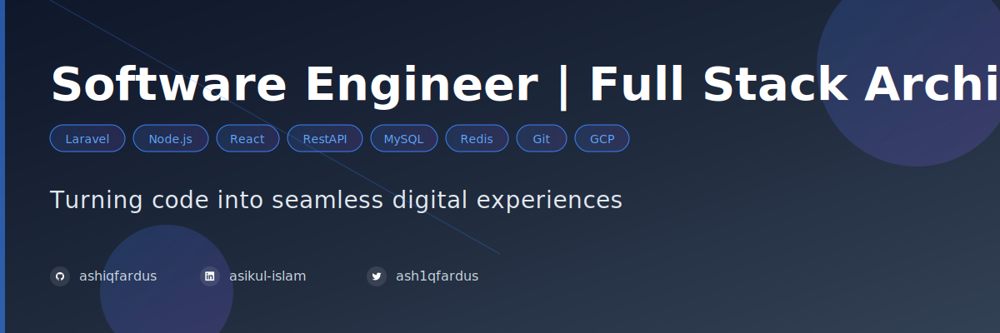

# Hi, I'm Md. Asikul Islam 

👑 **Software Engineer**  
🖊️ **Passionate About Clean, Scalable Code**  
🎤 **Love Sharing Knowledge Through Open Source**  
📫 **Reach Me:** [ashiqfardus@hotmail.com](mailto:ashiqfardus@hotmail.com)

---

## 👨‍💻 Software Engineer | Full Stack Architect

I'm a results-driven software engineer based in **Dhaka, Bangladesh** with **7+ years of expertise** in building scalable backend systems.  
I specialize in **Laravel**, **Node.js**, and **REST APIs**, and I'm passionate about creating **developer-friendly packages** and contributing to **open-source projects**.

---

### 📝 About Me

- 🔧 **Expertise:** Laravel, Node.js, REST APIs, MySQL, MongoDB, Redis, Elasticsearch
- 🎯 **Goal Driven:** Building reliable, scalable enterprise applications with 99.9% uptime
- 💡 **Tech Enthusiast:** Currently exploring MERN Stack & Mobile App Development
- 🤝 **Collaboration:** Always open to collaborating on open-source initiatives and innovative projects
- 🔭 **Currently Working On:** AIR ERP for Savoy Ice Cream Limited
- ⚡ **Fun Fact:** I am a great dreamer of day dreams

---

### 🚀 What I Offer

- 💻 **Backend Development:** Laravel, PHP, Node.js, Express.js with modern best practices
- 📦 **Package Development:** Developer-friendly, reusable Laravel packages for the community
- 🌐 **Full-Stack Solutions:** Building end-to-end web applications with modern frameworks
- 🏢 **Enterprise Systems:** ERP, VAT Management, Sales & Distribution systems
- 📚 **Continuous Learning:** Staying ahead with industry trends & emerging technologies

---

### 🛠️ Skills & Technologies

**Backend:**  

**Frontend:**  

**Databases & Search:**  

**Tools & Platforms:**  

**Other:**  

---

## 📦 Featured Open Source Packages

| Package | Description | Links |
|---------|-------------|-------|
| [Laravel Fuzzy Search](https://github.com/ashiqfardus/laravel-fuzzy-search) | A zero-config fuzzy search package for Laravel using Levenshtein distance, Metaphone, and Soundex. Features include typo tolerance, relevance scoring, field weighting, and async indexing. | [Packagist](https://packagist.org/packages/ashiqfardus/laravel-fuzzy-search) |
| [Horizon Running Jobs](https://github.com/ashiqfardus/horizon-running-jobs) | A monitoring tool for Laravel Horizon that provides real-time visibility into actively running jobs, with filtering and detailed execution metrics. | [Packagist](https://packagist.org/packages/ashiqfardus/horizon-running-jobs) |

---

## 💼 Professional Experience Highlights

### 🏢 Data Limited (Sister Concern of Savoy Ice Cream Limited)

**Assistant Manager (Software Engineer)** | June 2022 – Present

- 🚀 Led the development and enhancement of the **Savoy AIR ERP** system
- 📊 Designed and implemented primary and secondary sales modules, aligning with business requirements
- ⚡ Oversaw and maintained RESTful ERP services, ensuring **99.9% system uptime** and operational stability
- 🤝 Coordinated with cross-functional teams to deliver scalable and reliable ERP solutions

---

## 🎯 Featured Projects

- **Savoy AIR Sales & Distribution Management System** - Enterprise ERP with primary and secondary sales modules
- **VAT Management System** - Enterprise VAT Management System for efficient tax management and compliance
- **Savar Cantonment ERP** - Integrated ERP system managing multiple departments
- **IOT-based Ticketing & POS System** - Advanced system for Chiklee Water Park with IOT integration
- **[ReadyeShop](https://readyeshop.com/)** - E-commerce platform for product management and online sales
- **[Readjobs](https://readjobs.com/)** - Job portal platform connecting job seekers with employers
- **[RFID Based Exam Seat Management System](https://github.com/ashiqfardus/rfid-data-send-to-web-server)** - RFID technology-based system for automated exam seat management

---

## 🏆 Badges

---

## 🤝 Contact & Collaboration

I'm always excited to collaborate on:

- 🧩 **Developer-friendly Laravel packages**
- 🌍 **Open-source projects**
- 💡 **Innovative backend or full-stack solutions**
- 🏢 **Enterprise-level applications**

### 📫 Connect with Me

---

### 📄 Resume & Portfolio

---

  <i>⭐️ From <a href="https://github.com/ashiqfardus">ashiqfardus</a></i>

